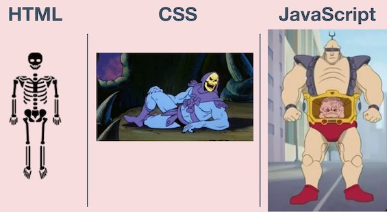

Let's continue our journey of teaching programming. In the previous post we talked about preparation and what we can do before starting the actual course. In this post we'll get into some ideas and practices we can use during the lessons.

This is the second part of series focused on teaching programming. You can read the first part [here](https://ugurtekbas.com/lessons-ive-learned-by-teaching-programming/){:target="_blank"}.
{: .notice}

## Show Time
How you deliver knowledge is as important as the knowledge itself. You can use some technics and methodologies which will clear most of the question marks for students. Some of the methods below
that I planned prior the lessons and some of them I came up after. As long as it works
for the students, it's totally fine to change, add or discover different ways during the whole course.

Now you're prepared and here you are, stage is yours!

### Keep It Simple
Like in one of the most underrated [software principles](https://en.wikipedia.org/wiki/KISS_principle){:target="_blank"}, keep it very simple when you’re explaining new concepts or languages. Associate the concept with something concrete from real life. This will make the subject less scary and easier to understand for your students.

<figure>
	
	<figcaption>This is the image I created to explain what those languages do, in simplest way.</figcaption>
</figure>

You can also apply the “explain it to me like I’m 5 years old” rule. Don’t worry people won’t mind, they just want to understand things.

Another advice would be: don’t give examples right away. Make them understand it first then do a general example which covers the topic. This way you also avoid squeezing the topic only in one example which might limit the way they are looking at it.

### Practice makes it perfect, practice makes it amazing
It’s very important to make students practice right on the spot. With exercises they learn way more than with any other method. Power of practicing within the lessons is underrated…or I just didn’t know about it.

It might feel weird to give students a block of few 15 minutes to work on their own when you have limited time for a session, but it is definitely worth it. First keep the exercise simple, let them try to figure things out, and watch how they approach the problem. You can literally sneak up to their monitor and talk about their approach. After 10-15 minutes, show the solution with some live-coding, where they can easily follow. If there are multiple solutions to the problem, you can show a few different approaches. As a last step, show them a real life example about the exact practice. It could be adding a nice footer to your website or using a random number function in JavaScript.

If you apply the [10000 hours rule](https://en.wikipedia.org/wiki/Outliers_(book)){:target="_blank"}, yourstudents need to practice outside of the course too, it’s called "Homework". Coming up with good homework is really hard (shout out to all my former teachers out there who came up with creative homework when I was studying). I consider three things while preparing a homework:

- Including the subjects we learned in the last lesson
- Making it useful so that they can easily imagine a different implementation for their different ideas
- Making it challenging

During my first course, I noticed it’s good to have continuous homework rather than creating a new one every time. I call it lego-style    homework (I literally made that up). What you do is giving small pieces of homework, that fulfill the three characteristics above, after the first lesson, and in every lesson after that you add new parts to this project. At the end of the course, students will have a useful product which is completely built by them.

When I was teaching web development, I asked my students to come up with a website idea, create their first html file, give it a title and put a headline in the middle of the page. After learning about different tags (like link, image etc.) I asked them to create a top menu bar and navigate to different pages. Following that, I asked them to create a footer, put images in the centre of their page, create columns, and write long paragraphs. When they learned how to use Bootstrap I asked them to replace columns by using grids, to style their site using CSS, and to add a form to their contact page.

I also asked them to do research on specific topics, just to get the basic ideas and to understand that this is also part of programming, a huge part of it. I believe power of homework, it effects the learning process significantly, especially for practice-heavy fields, such as coding.

## Question or be questioned
Your students will want to ask you anything and everything which is absolutely fine. Your job is to make them feel totally relaxed about asking questions. Show them they can stop you and ask questions any time, no matter how silly or simple they are.

<figure>
	
	<figcaption><a href="https://fresnostategraduatewritingstudio.wordpress.com/2018/11/19/week-13-do-not-be-afraid-to-ask-questions-and-get-assistance/"><small>(image source)</small></a></figcaption>
</figure>

You can do this by repeating the sentence “Do you have any questions?” every time after explaining something or asking them questions during lessons to see if they are clear of any confusion. You can also show them how to get answers themselves which is simple googling. Demonstrate how to search for the usage of an attribute or documentation by just googling in front of their eyes, and guide them to the wonderland of StackOverflow.

## Give them a break
Not joking! :) Small breaks are part of the lesson. It helps them to refresh and take a deep breath before solving that annoying bug. At my first lesson, I was so focused on our topics that I forgot to give a break. That was the first thing we discussed at the end of the day, at our daily retro.

## Have fun
It’s essential! Try to make it fun for anyone who attends the lessons. It’s already hard enough to learn new things, so make sure it’s fun. Create a comfy, easy environment and a soft language to follow effortlessly.

There are programming-related games where you can have fun while testing your coding skills. You can play them in the class together with your students or give them as homework.

---
These are the main practices I've followed for my course. I've received good feedback during and after the lessons as we discussed more about our approaches end of every day.

**What do you think about the methods above? Do you have any different practices you can apply
for the best teaching experience? Let me know in the comments below!**
{: .notice}

---
### Say hi to me [on Twitter](https://twitter.com/ugurtekbas){:target="_blank"}
