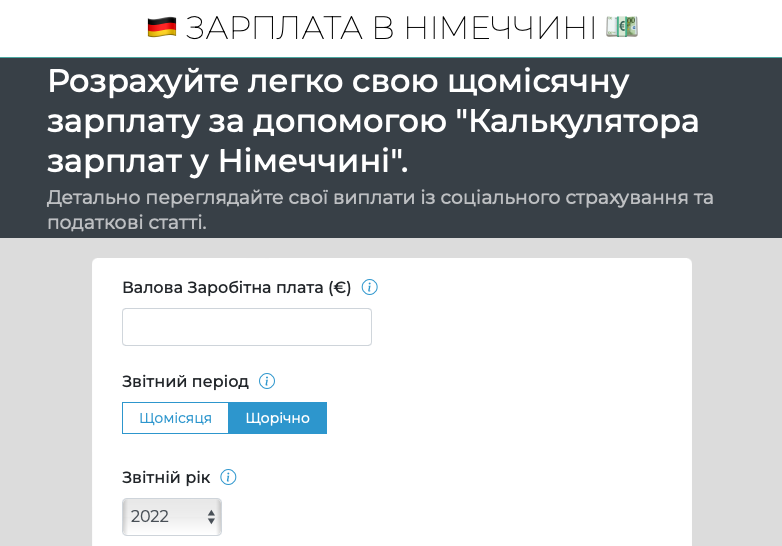

Every now and then I need a calculator to check details about my social contributions or tax deductions from my salary. I go to one of the known salary calculator websites for Germany either in German or in English. In one of those days, I noticed there was no calculator in Turkish, people (me included) probably use the English version and that's helpful enough. On the other hand, examining these details in their native language would be beneficial. Building such a tool would be a good opportunity for me to learn new things so I jumped on the opportunity. That's how [Almanya Maas](https://www.almanyamaas.com/){:target="_blank"} came into life.

<figure>
	
	<figcaption></figcaption>
</figure>

After studying existing tools, I decided to build Almanya Maas on three principles:

1. **Simplicity**: From website title to calculator form and to result page, everything should be simple. First version should be as simple as possible. Users should fill in as little information as possible to prevent confusing them. That's why in the first version I omitted few entry fields, used a fixed value for public health insurance. After attracting certain amount of user, I iterated and allow them put in more details for more accurate and realistic results.

2. **Information**: Users should understand what they need to know and why they need it. That's why I added explanations for each section of the form in the same page. Users easily scroll down and read about every item on the form, with suggested options for different cases.

3. **Clarity**: In the result page, it shows the most important number users want: monthly net salary. Below it, in a simple table, they can see all the calculation details both monthly and yearly manner.

<figure>
	
	<figcaption></figcaption>
</figure>

After releasing the first version, I kept developing and adding new things to the calculator, watched users coming more and more, fixed few bugs here and there and did experiments. Here are few things I've learned while running this website:

## 🏠 Domain Name
Before I buy the domain name, I did a short keyword research and decided to buy [almanyamaas.com](https://www.almanyamaas.com/){:target="_blank"}. `Almanya Maas` literally means `Germany Salary`. That was the keyword that was searched the most, numbers weren't so high but demand was there. With zero marketing, it now has **3000 monthly unique visitors**, %100 organic. I knew picking a domain name was very important for any project but I was not expecting such a huge return. More people came from searching, visiting and spending time on the website, it was shown higher in search results which attracted even more users.

## 🧩 Iteration
Since I started working with iteration in every project, directions started getting clearer, priorities revealed easily and building became hassle-free. For the first version of the calculator I built only the most necessary parts and left out the rest. For example on the result page, it was only showing net montlhy salary and some monthly details. I let this version brew until it got traction. After seeing increasing numbers of visitors, I started building one feature, one change, fixing one bug at a time. Keeping changes in minimum also helped keeping codebase in shape and offered users value continuously.

## 🎙 Talking to Users
Except pages such as [about](https://almanyamaas.com/pages/almanya-maas-hesaplama-araci-hakkinda.html){:target="_blank"}, I don't have many contact points with the users to get feedback. I've created a small feedback component next the form but it was not really used. This led me to guess about `users' needs`. I worked on a sharing feature where people can share their calculation results with others. It took me some time to finish, after release not many made use of it. So I ended up spending quite some energy to build a feature I thougt was very helpful which wasn't really used at the end, because I did not talk with the users enough.

## 🇺🇦 Ukrainian Version
After seeing the first website creating value and people keep coming, I thought why not creating the same thing in Ukrainian. Luckily a dear friend of mine speaks fluent Ukrainian, so I asked him for help and he translated the entire tool in few hours. I bought a new Ukrainian domain name following the same methods and that's why [Zarplatavgermanii](https://zarplatavgermanii.com){:target="_blank"} is alive now 🥳.

<figure>
	
	<figcaption></figcaption>
</figure>

---

I hope you like reading the back story. Let me know if you wish any additional features or any questions. 

### Say hi to me [on Twitter](https://twitter.com/ugurtekbas){:target="_blank"}
