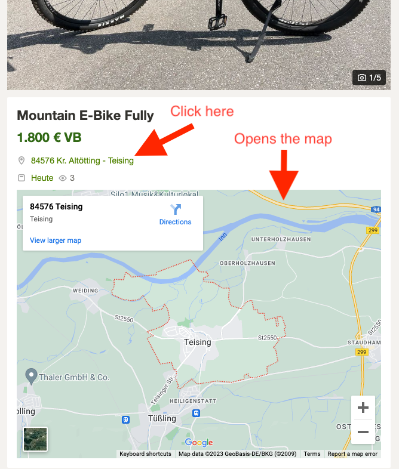
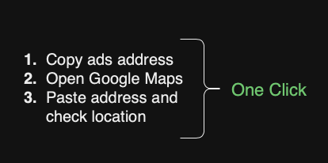
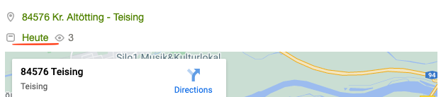

I started preferring second-hand items more and more over new ones. Both for environmental and financial reasons. You would be surprised how amazing things you can find in the second hand market. That's where I wanted to buy my next adventure partner a.k.a my future bike, as well. 

In Germany, one of the biggest online second hand markets is [Kleinanzeigen](https://www.kleinanzeigen.de/) (used to be called Ebay Kleinanzeigen). I started checking out the ads very often, almost daily. While I was evaluating the bikes' price, features, I was also checking seller's address to know if it's in my reach to try out the bike. The problem with this approach is you can not know every other street in town. I'm sure even experienced taxi drivers would have problems remebering every street name in the city. That's why I was repeating the steps below for each ad:

1. Copy ads address
2. Open Google Maps
3. Paste address and check location

After following this method for tons of ads every day, I thought there has to be a **better, easier, quicker way**. And that's how [**Kleinanzeigen Plus**](https://chrome.google.com/webstore/detail/kleinanzeigen-plus/cgailbbhhcmdglfanagajfjffdmbcfoi?hl=en-GB) came to life! It's a light weight Chrome extension to highlight ad's physical address like a link, when link is clicked it opens Google Maps right below the address and shows the exact location with a pin.

<figure>
	
	<figcaption></figcaption>
</figure>

With this tiny extension, all the previous steps became **one simple click**.

<figure>
	
	<figcaption></figcaption>
</figure>

## ✨ More features
Another feature of Kleinanzeigen Plus is showing the number of days since the ad was created. Normally the exact date is displayed in ads but that doesn't mean much if you wanted to know how old the ad is. Similar to the address date is also looks highlighted with a different color, when it is clicked it shows also the normal date format so you have both options.

<figure>
	
	<figcaption></figcaption>
</figure>

---

I have developed this extension to scratch my own itch and I hope it helps others as well. Let me know if you have any feedback or suggestions.

### Say hi to me [on Twitter](https://twitter.com/ugurtekbas){:target="_blank"}
