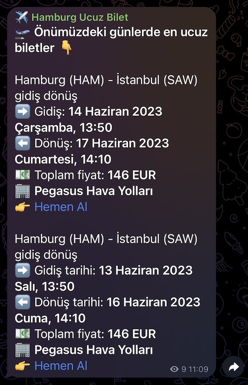

Every year I found myself checking flight tickets to Turkey several times. My timeframe and destination might change due to different constraints, but usually I try to find the most affordable tickets. In one of those days, I thought to myself; `what if there was a robot who would always know when the cheapest ticket is and notify me about it?`. That's how Hamburg Cheap Tickets channel came to life.

<figure>
	
	<figcaption></figcaption>
</figure>

I built a tiny bot; that checked the cheapest deals between Hamburg and Istanbul every day and saving all details into a database. At this point half of the job was done; I had the data but I wasn't being notified yet. If I wanted to see the best deal, I had to go to database console. That's even worse than checking tickets on airline websites...wait maybe not that bad! Meanwhile, I noticed there might be many people who need the same kind of tickets every year. Which would be a nice niche user base.

## 📰 The Medium
The next step was wrapping this data into a readable message with enough detail and send it to me. Initially I thought about using emails but for that I would need to capture people's email addresses first, which would be a different hassle. I wanted users to get the benefit if they thought it was something for them. A group on instant messaging apps would be great idea, people could join the group with one click and bots would send messages to the group. However WhatsApp doesn't have a public API. On the other hand Telegram not only has an API but also allows the creation of chatbots. Thanks to its comprehensive documentation, your bot can be runnning literally in few minutes. The medium for cheap ticket notifications became a **Telegram channel** where my bot posts messages and people can join this channel to be notified of the best deals.

## 💌 The Message
At this point application flow was as follows: everyday the cheapest deals are being checked few times, details saved and once a day, 2 best tickets details were sent to Telegram channel. If there hadn't been a good deal in the past 2 days, bots would send the latest best ones, ensuring that there were always up to date deals in the channel. I kept the messages as short as possible with maximum benefit details. Next to dates and prices, I also added the airline name and a link which when clicked, directed users to ticket page where they can purchase the related ticket with few clicks.

After running this flow for a while, I noticed an extra benefit. Naturally, I was being notified whenever there was a good deal but additionally I was aware of the price changes of the usual tickets. Because bots were sending new deals continuously.

## 💌 Constraints
As soon as I thought about this cheap tickets helper, I realized how many constraints it comes with. First of all, users can not really select their departure and return dates. Bots focused on finding the best deal regardless of the dates. The second point was destinations; departure was set to Hamburg and I added two most popular destinations from Hamburg to Turkey: Istanbul and Antalya. With the help of these constraints, I found a niche area where I can test the idea. If people used it, I could easily expand it to make it more customizable.

<figure>
	
	<figcaption></figcaption>
</figure>

---

I hope you like reading the back story. Let me know if you wish any additional features or any questions. 

### Say hi to me [on Twitter](https://twitter.com/ugurtekbas){:target="_blank"}
